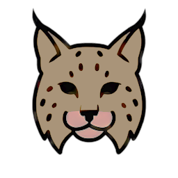
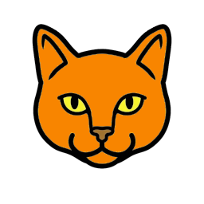

# Wild Cat Shogi

A casual 3x5 shogi variant.

## Pieces

| Piece | Image | SFEN | Fairy Piece | Movement |
|-------|-------|------|-------------|----------|
| Tiger |  | K | King | 1 square any direction |
| Puma |  | R | Wazir | 1 square orthogonally |
| Lynx |  | B | Ferz | 1 square diagonally |
| Cat |  | P | Pawn | 1 square forward, promotes to Wild Cat |
| Wild Cat |  | G | Gold | 1 square orthogonally or diagonally forward (promoted Cat) |

## Rules

- Captured pieces go to your hand and can be dropped on empty squares
- Pawns promote to Gold on the last rank
- No nifu rule (multiple pawns in the same file allowed)
- No uchifuzume rule (pawn drop checkmate allowed)
- **Win conditions:**
  - Checkmate the opponent's king
  - Move your king to the opponent's back rank (try rule)
- 4-fold repetition (including perpetual check) is a draw

## Starting Position

|   | 3 | 2 | 1 |
|---|---|---|---|
| <br>一<br> |  |  |  |
| <br>二<br> |  |   |  |
| <br>三<br> |   |   |   |
| <br>四<br> |  |   |  |
| <br>五<br> |  |  |  |

## Testing with Fairy-Stockfish

### Check variant syntax

```bash
fairy-stockfish check variants.ini
```

### Interactive play

```bash
fairy-stockfish load variants.ini
```

Then enter UCI commands:

```
uci
setoption name UCI_Variant value wildcatshogi
isready
position startpos
d
go depth 10
```

### Move format

- Regular moves: `a2a3` (from square to square)
- Drops: `P@b3` (piece @ square)
- Promotion: `a4a5+`

### Run commands from file

Create a file `commands.txt`:

```
uci
setoption name UCI_Variant value wildcatshogi
isready
position startpos
d
go depth 15
quit
```

Run:

```bash
fairy-stockfish load variants.ini < commands.txt > result.txt
```

## Rust Library Support

The following forked Rust crates support Wild Cat Shogi:

| Crate | Fork | Description |
|-------|------|-------------|
| shogi-rs | [Arborescent/shogi-rs](https://github.com/Arborescent/shogi-rs) | Board representation and move generation |
| shogi-kifu-rs | [Arborescent/shogi-kifu-rs](https://github.com/Arborescent/shogi-kifu-rs) | Game record parsing with variant support |
| usi-rs | [Arborescent/usi-rs](https://github.com/Arborescent/usi-rs) | USI protocol for engine communication |

These forks extend the original crates to support non-standard board sizes (3x5 for Wild Cat, 5x5 for Minishogi).

## Piece Set

The `pieces/` folder contains a Wild Cat themed piece set. These images are released under [CC0 1.0 Universal (Public Domain)](https://creativecommons.org/publicdomain/zero/1.0/).
